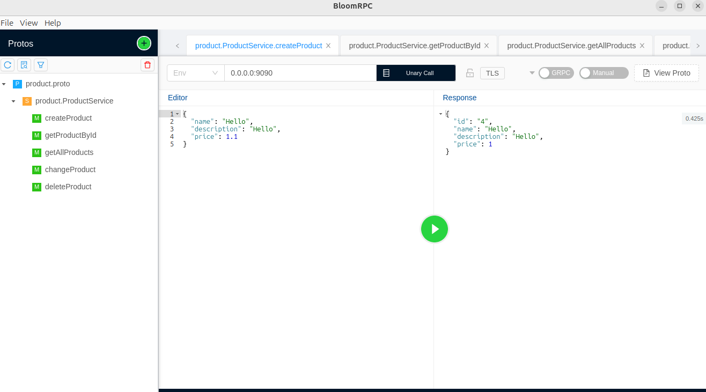
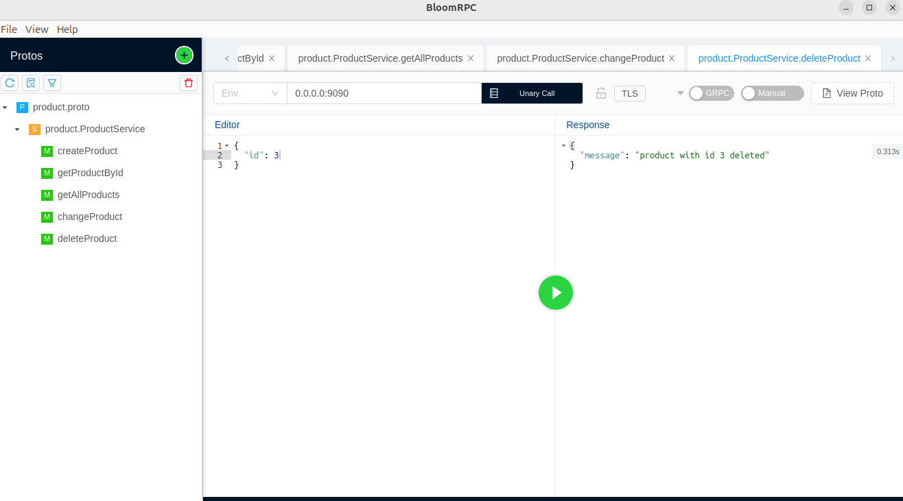
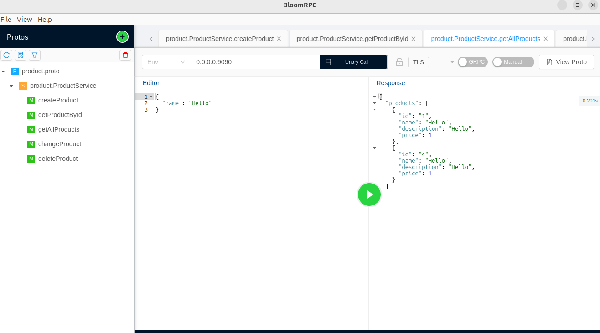

<!DOCTYPE html>
<html lang="pt-BR">
<head>
  <meta charset="UTF-8" />
</head>
<body>

  <h1>gRPC CRUD Service</h1>

  
Este projeto demonstra como desenvolver uma aplicação simples de CRUD (Create, Read, Update, Delete) utilizando gRPC. O serviço gerencia uma coleção de itens, como registros de usuários, produtos ou notas, estabelecendo uma comunicação eficiente entre cliente e servidor.

  

    
    
    
  

  

    <h2>🔧 Tecnologias Utilizadas</h2>
    <ul>
      <li><strong>Java</strong></li>
      <li><strong>gRPC</strong></li>
      <li><strong>PostgreSQL</strong></li>
      <li><strong>Gradle</strong></li>
      <li><strong>Docker</strong></li>
    </ul>
  

  

    <h2>📁 Estrutura do Projeto</h2>
    <pre>
grpc/
├── docker/
├── gradle/
├── image/
├── src/
│   ├── main/
│   │   ├── java/
│   │   └── resources/
├── .gitattributes
├── .gitignore
├── build.gradle
├── gradlew
├── gradlew.bat
└── settings.gradle
    </pre>
  

  

    <h2>🚀 Como Executar</h2>
    <ol>
      <li><strong>Clone o repositório:</strong>
        <pre><code>git clone https://github.com/eulerBM/grpc.git
cd grpc</code></pre>
      </li>
      <li><strong>Compile o projeto:</strong>
        <pre><code>./gradlew build</code></pre>
      </li>
      <li><strong>Execute o servidor gRPC:</strong>
        <pre><code>./gradlew run</code></pre>
      </li>
      <li><strong>Execute o cliente gRPC:</strong>
    
      </li>
    </ol>
  

  

    <h2>✅ Funcionalidades</h2>
    <ul>
      <li>Criação de novos itens.</li>
      <li>Leitura de itens existentes.</li>
      <li>Atualização de itens.</li>
      <li>Remoção de itens.</li>
    </ul>
  

  

    <h2>🤝 Contribuição</h2>
    
Contribuições são bem-vindas! Sinta-se à vontade para abrir <em>issues</em> ou enviar <em>pull requests</em>.

  

  

    <h2>📄 Licença</h2>
    
Este projeto está licenciado sob a licença MIT. Consulte o arquivo <code>LICENSE</code> para mais detalhes.

  

  <footer>
    
Para mais informações, visite o repositório oficial: <a href="https://github.com/eulerBM/grpc">eulerBM/grpc</a>.

  </footer>

</body>
</html>
